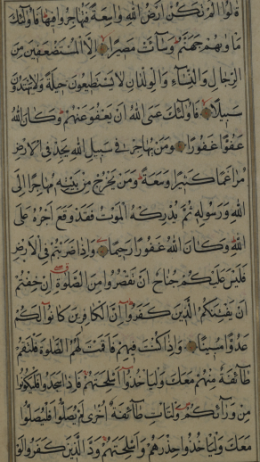
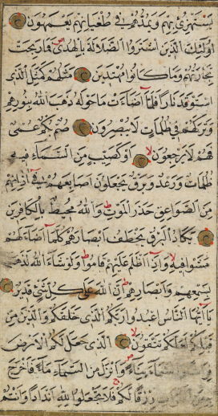
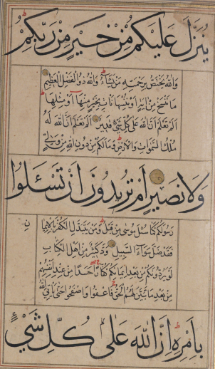
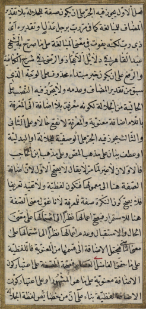
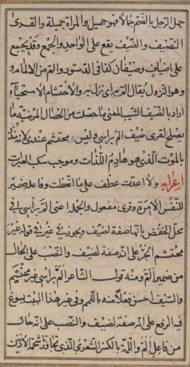
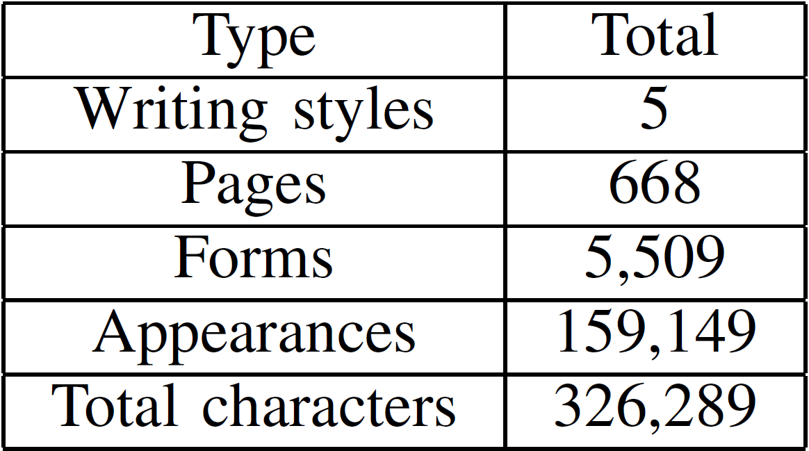
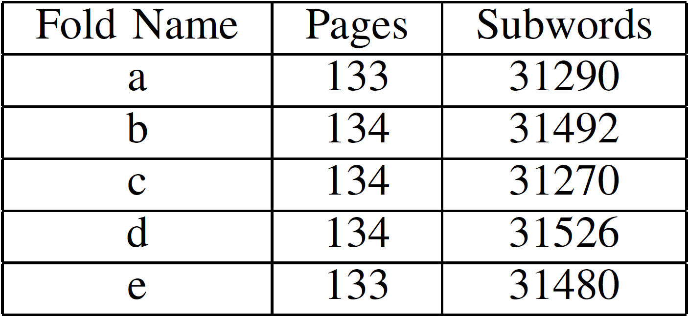

## VML-HD: The Historical Arabic Documents Dataset for Recognition Systems

A new database with handwritten Arabic script. It is based on five books written by different writers from the years 1088-1451\. We took 668 pages from these five books, and fully annotated them on the sub-word level. For each page we manually applied bounding boxes on the different sub-words and annotated the sequence of characters. It consists of 159,149 sub-word appearances consisted of 326,289 characters out of a vocabulary of 5,509 forms of sub-words. The database is described in detail and is designed for training and testing recognition systems for handwritten Arabic sub-words. This database is available for the purpose of research, and we encourage researchers to develop and test new methods using our database.

## Dataset Information: 5 Folds Version

The dataset contains 5 manuscripts totaling 668 pages, annotated on the subword level. These manuscripts are split to five folds named 'a','b','c,'d', and 'e'. Each fold contains randomly chosen 20% pages from each manuscripts. The recognition score will be calculated using the Mean average precision (MAP) score. Mean average precision is a widespread measure for the performance of information retrieval systems. The metric is defined as the average of the precision value obtained after each relevant word is retrieved.  

  
  

Each track of the two contains the folds images and annotation information in their own format.  

## Segmentation Based Track

In this track, you will receive the documents segmented, where each image of a manuscript page is segmented to its corresponding annotation information and stored in its own folder labeled with the same name of the manuscript page image name.Along with each folder containing the subwords, the annotation data are also provided. For this track it is expected that segmentation based algorithms are used to recognize the subwords found in the dataset.  

[Data for Segmentation Based Track](https://drive.google.com/open?id=12qCqdFnJgDR18UcRaPhdp-LaV-UEDyZB)  

## Segmentation Free Track

In this track, you will receive the documents unsegmented, where each image will contain a complete manuscript page. Along with each page, the annotation data are also provided. For this track it is expected that segmentation free algorithms are used to recognize the subwords found in the dataset.  

[Data for Segmentation Free Track](https://drive.google.com/open?id=13H8xjUzr1s1Nh5DEb6YNF9Gqseelimf0)  

For any inquiry please send an email to the organizers at majeek at cs dot bgu . ac dot il

To download of the files for each track of the two, please click [here](https://goo.gl/m4qD1E).

## Copyright and Citation

This dataset is intended for research purposes only. If you wish to use the dataset for anything besides research, you must get our explicit consent.

If you download and use the dataset in your research, you must cite our paper:  
@inproceedings{kassis2017vmlhd,  
title={VML-HD: The Historical Arabic Documents Dataset for Recognition Systems},  
author={Kassis, Majeed and Abdalhaleem, Alaa and Droby, Ahmad and Alaasam, Reem and El-Sana, Jihad}, booktitle={1st International Workshop on Arabic Script Analysis and Recognition},  
year={2017},  
organization={IEEE}

[Download Database](https://drive.google.com/open?id=1Eg9KEUzPpiWZPQF91lHll0a6fcpuGs2h)  
[XML Files](https://drive.google.com/open?id=1Cw8CTYxXXbu11JhOF4zSudyEA9RX-rjJ)

